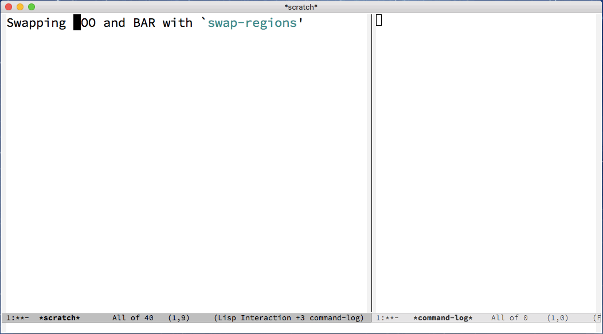

# swap-regions.el

## Introduction

This package provides a command `swap-regions`, which swaps the current region
and the previous region. When called with prefix argument, do a replacement
between the current region with the previous region.

## Screenshot

## Setup

If you install this package with Emacs's packaging system, no setup is
required.

(Optional) To bind the command `swap-regions` globally, use e.g.:

    (global-set-key "\C-c\C-t" #'swap-regions)

## Compatibility

`swap-regions.el` doesn't support the rectangle region (`C-x <SPC>`) or any
other nonstandard region.
